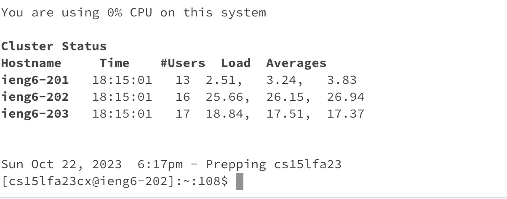

Screenshot of Hello:

Screenshot of How are you:

Methods called: 
- .getPath()
- .equals()
- .length()
- .append()
- .toString()
- .getQuery()
- .split()

Explanation:
- getPath() method checks the url link.
- equals() checks if the url link has /add-message
- length() checks if the length of the message is 0
- append will append the number of messages and append the messages
- toString() will convert the message to a string
- getQuery() gets the information
- split() will split the link into two before and after "="

Values changed:
- The int i is increased by 1 after inserting a different message each time in the link. The integer i keeps track of the amount of times we input a new message/
- String is being changed whenever we input a new message

Part 2:
Path to private and public:

Not asking for password:

Part 3:
I didn't know that a link contained different names such as paths and domains. I also didn't know that we could access a certain directory or files. These were all things that surprised me coming into CSE15L. 

