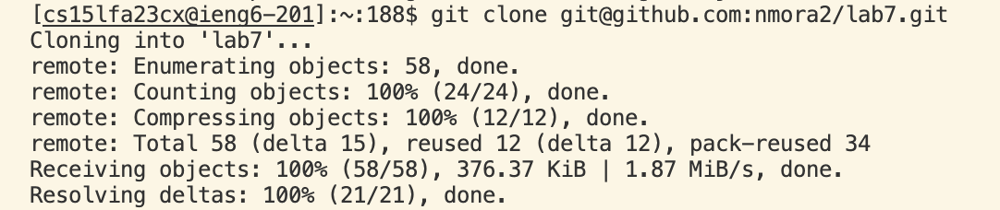

4) Log in

I pressed the key `<up><up><up<up>` to access my commands history which led to ssh cs15lfa23cx@ieng6.ucsd.edu then pressed `<enter>` to execute the command.
in order to log in. 

5) Fork and clone

In github,  forked the assignment then copied the SSH link. On the visual studio code terminal, I typed git clone then pressed `<COMMAND+V>` to paste the SSH link and pressed `<enter>` to execute the command.

6) Failed tests

To go into the correct directory of the file, I clicked on the terminal to type cd lab7 and pressed `<enter>` to execute the command. Then to test the code, I clicked on the terminal to type bash test.sh then I pressed `<enter>` to execute the command. 

8) Fix code

I first typed vim ListExamples.java into the terminal, then I kept pressing the `<down>` key to go 
down to the method that needs to be fixed. When my mouse was hovered over the method that I was looking for, 
I then pressed `<right>` key 7 times to get my mouse on index1 and pressed i when my mouse was over the 1. I pressed 2 
and deleted 1 to correct index1 to index2. After this, I pressed escape to get out of insert mode and 
typed :wq to save my changes and exit vim. 

8) Run passed tests
   
   I pressed `<up> <up> <up>` to access bash tesh.sh from my history commands and
   pressed `<enter>` to determine if the tests passed or not.

9) 
   
   In the terminal, I typed git add ListExamples.java then pressed `<enter>` and then typed git commit -m "Your code has been saved" and pressed `<enter>`. After the command executed, I typed git push -u origin main and pressed `<enter>`.
