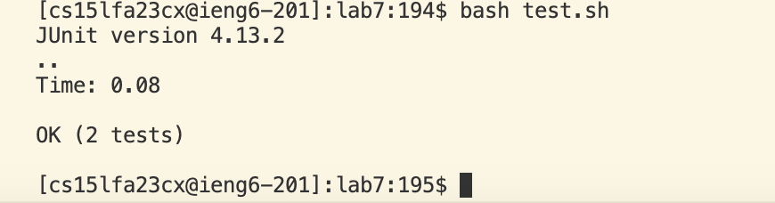

4) Log in

I pressed the key <up> a couple times to access my commands history which led to ssh cs15lfa23cx@ieng6.ucsd.edu
in order to log in. 

5) Fork and clone

6) Failed tests

7) Fix code

I first typed vim ListExamples.java into the terminal, then I kept pressing the  <down> key to go 
down to the method that needs to be fixed. When my mouse was hovered over the method that I was looking for, 
I then pressed <right> key 7 times to get my mouse on index1 and pressed i when my mouse was over the 1. I pressed 2 
and deleted 1 to correct index1 to index2. After this, I pressed escape to get out of insert mode and 
typed :wq to save my changes and exit vim. 

8) Run passed tests
   
   I pressed <up> <up> <up> to access bash tesh.sh from my history commands and
   pressed <enter> to determine if the tests passed or not.

9) 
   
