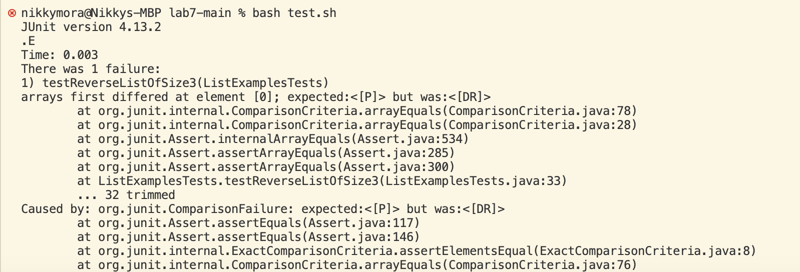
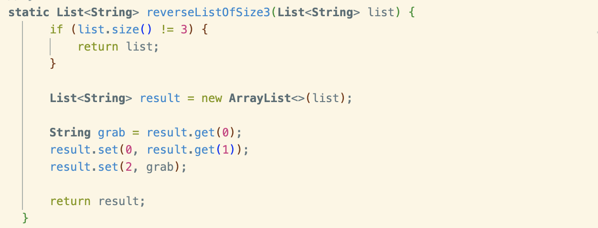
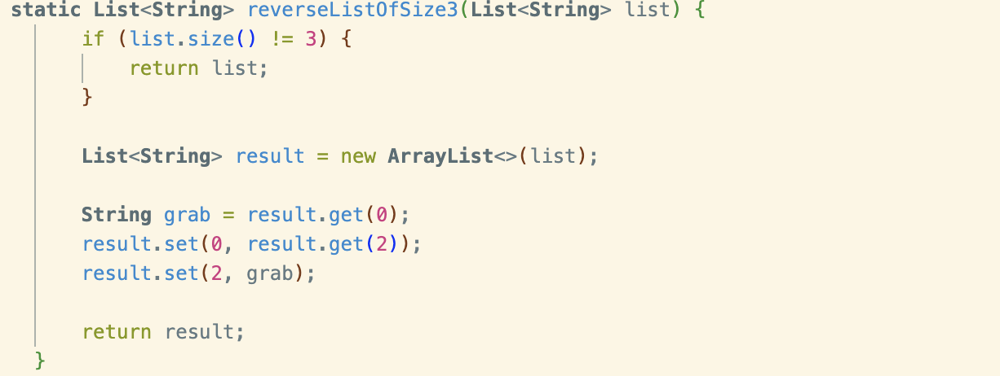
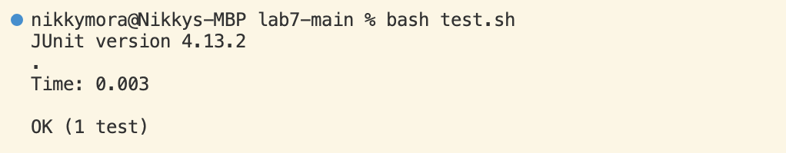

1) Me: Hi, I am currently having issues with my code. I intend to make an array list to then
reverse the array list if it's length is 3,  but I keep getting an error.

2) TA: Can you please show me what the error output in the terminal?

3) Student: Yes, this is what the terminal is showing me.

4) TA: When you want reverse a list, you have to swap the first and last index in order to reverse
the order of an array list. Can I see how you're reversing your list?

5) Student: Here is my code, I am trying to swap the first and last elements in a list.
   

6) TA: You are currently setting the first element to be the same as the the second element. This
   could be the mistake. Try swapping it to the correct index in  order to reverse the list.

7) Student: Ohhh, thank you so much! Here is my fixed code maybe this should work. I see now that
   I was supposed to grab index 2, not 1, in order to correctly swap the array list.
    
    

9) Student: This is the test that correctly passed the code.
    

   Reflection:
   I found vim mode to be so interesting. I never knew you could access a code through the terminal
   and edit it by pressing keys and :wq to exit and save. Personally, when things shock me, it stays
   with me and I know I won't forget how to use vim. 
   

