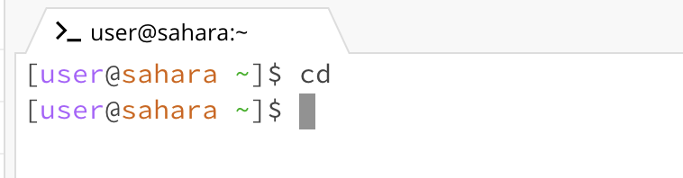
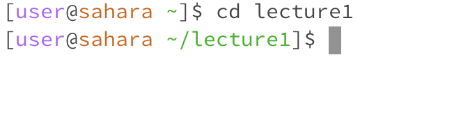
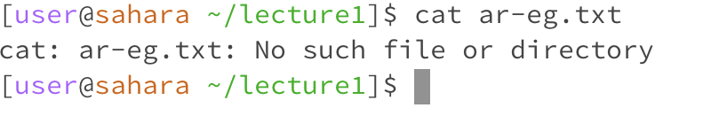
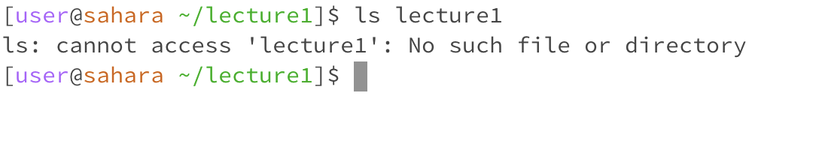
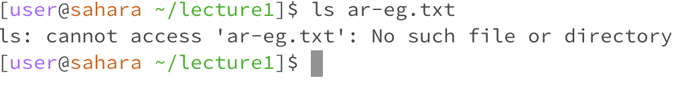

When I run cd in the terminal, I want to change the directory. However, I did not specify the path I wanted to change to so nothing came up. 

When I ran cd lecture1 in the terminal, cd was given a path to change directory to so the terminal will now allow me to look into lecture1.

In this case, I gave cd a path to ar-eg.txt. However, ar-eg.txt is a message, not a file so the terminal is right on indicating there there is no such file. 

I gave cat a path to print the contents for, but ar-eg.txt is not a file so the terminal will indicate that there is no such file or directory.

In this case, I did not give the cat a path to go to so nothing was printed out.

