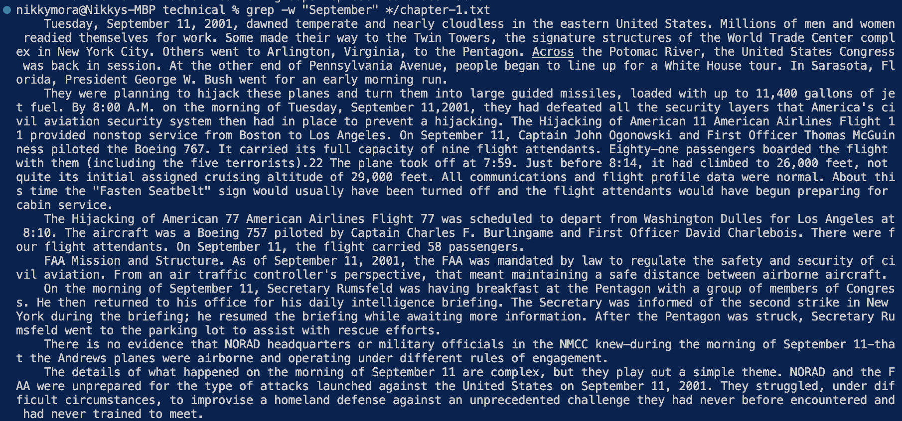

PART 1:
Failed test:

``` java
  @Test
  public void reverse() {
    int[] input1 = {0, 1, 2, 3, 4, 5};
    ArrayExamples.reverseInPlace(input1);
    assertArrayEquals(new int[]{5, 4, 3, 2, 1, 0}, input1);
  }
```
Output:


Does not induce a failure:


Output: 


The bug before:


The bug after:


Explanation: 
- The fix addresses the issue because at first, the method returnes the original array
instead of the new Array. If we wanted the array to be reversed, we would have to return
the new array and not the original which is why the code I provided, after the bug, works
for reversing the array. 

PART 2:
- grep-w



This command, grep-w "__" */file ,finds the word "treatment" and "September" in the file that
I want to look at and it returns every line that includes those words, but this command only works
for COMPLETE words.


- grep-c


This command, grep-c "__" */file ,counts the amount of times the word occurs in the
file that I want it to look at. 


- grep-b


This command, grep -b --colour -n "__" */file ,highlights the word that I
want to find in the file. 


- grep name file


This command, grep "__" */file ,looks for the exact pattern that I input. This command
works for a letter and also works for COMPLETE words. 


SOURCE: I typed "man grep" into the terminal, and it gave me so many options of how
I can use the command "grep" for technical. 


